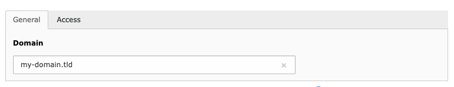
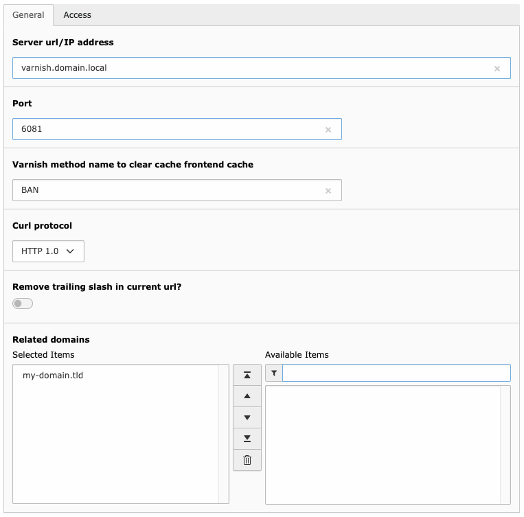

.. ==================================================
.. FOR YOUR INFORMATION
.. --------------------------------------------------
.. -*- coding: utf-8 -*- with BOM.

.. include:: ../Includes.txt

.. _admin-configuration:

Configuration
=============

In order to make TYPO3 automatically clear the varnish cache for pages, when page content is changed or when the
"Flush frontend caches" / "Flush all caches" functions are used, you need to configure at least one domain and one
Varnish server configuration.

It is recommended to save the configuration records either on the rootpage or the domain start page.

Configuration Records
~~~~~~~~~~~~~~~~~~~~~

Varnish controlled domains
--------------------------

This database record includes only one field, which is the domain name.

.. important::

Please make sure, to only enter the domain name without schema or slashes.

Varnish server configuration
----------------------------

The Varnish server configuration record holds the configuration data for the Varnish server along with the
domain(s) which are controlled by the varnish server.

.. t3-field-list-table::
 :header-rows: 1

 - :Field:
         Field:

   :Description:
         Description:

 - :Field:
         Server url/IP address

   :Description:
         The URL or IP address of the varnish server. Make sure to **not include** any schema or slashes in this field.

 - :Field:
         Port

   :Description:
         Port of the varnish server

 - :Field:
         Varnish method name to clear cache frontend cache

   :Description:
         Typically, this field is either configured with `BAN` or `PURGE`. Please set this value according to your
         Varnish server setup.

 - :Field:
         HTTP protocol

   :Description:
         HTTP protocol version to use for the Varnish clear cache request.

 - :Field:
         Related domains

   :Description:
         Must contain at lease one domain which is controlled by the varnish server.

TypoScript Configuration
~~~~~~~~~~~~~~~~~~~~~~~~

The extension ships with a TypoScript configuration which is required in order to render uncached content
elements using Edge Side Includes (ESI). Varnish fetches uncached content elements by a HTTP request using
a specific page type in TYPO3.

By default the new page type `12345` is set for uncached content elements. If you need different page type
just change it by using constant editor.
