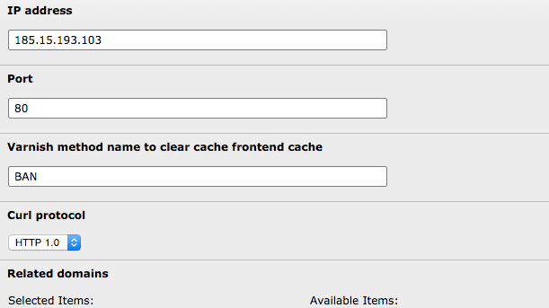

.. ==================================================
.. FOR YOUR INFORMATION
.. --------------------------------------------------
.. -*- coding: utf-8 -*- with BOM.

.. include:: ../Includes.txt

.. _configuration:

Configuration Reference
=======================

Target group: **Developers**

.. _configuration-typoscript:

Default configuration
---------------------
* By default a new page type is set for uncached content elements. If you need another page type just change it by using constant editor.

Varnish Server Configuration
----------------------------
* Best suited set up your varnish server configuration on rootpage or domain start page.

* If fully configured, varnish cache is cleared automaticcly for each configured domain on "Clear frontend cache", "Clear current page cache" or even a record has been changed on page.

